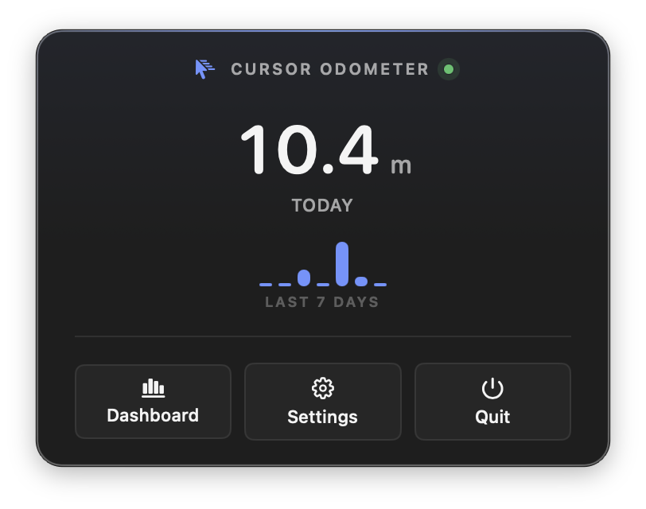

<p align="center">
  
</p>

<h1 align="center">Cursor Odometer</h1>

> An odometer for your cursor.

<p align="center">
  
  
  
</p>

Cursor Odometer is a native macOS menu-bar utility that measures, in real measurements, the physical distance your mouse cursor travels — today, this week, and across the lifetime of your Mac. It is local-only and single-purpose by design. Nothing leaves your Mac.

---

## Install

### Homebrew (recommended)

```sh
brew tap shmoopi/cursor-odometer https://github.com/shmoopi/cursor-odometer
brew install --cask cursor-odometer
```

### Manual

Download the latest signed, notarized DMG from the [Releases page](https://github.com/shmoopi/cursor-odometer/releases/latest), open it, and drag **Cursor Odometer** into `/Applications`.

---

## Features

- Live menu-bar distance counter, updated automatically
- Today / Week / Month / All-Time totals
- Per-display tracking on multi-monitor setups
- Dashboard window with line chart, per-display bar, and 7×24 time-of-day heatmap
- Achievements computed from your real motion (1 km, marathon, centurion, equator…)
- Custom units (km, mi, m, ft, marathons, banana, my cat — anything you want)
- CSV export
- Menu-bar customization (glyph or text label, three formats)
- Reset Today, Reset All Data, Pause Tracking
- Sleep/wake aware — does not count cursor reposition on display wake

---

## Architecture

A measurement core (`EventSource → Sampler → DistanceCalculator → Aggregator → PersistenceStore`) runs continuously in actors, decoupled from a `@MainActor` SwiftUI presentation layer. Distances are integrated in fixed-point `Int64` micrometers so the lifetime number does not drift; per-display physical size is read from each monitor's EDID. SQLite storage.

---

## Build

### Fast iteration (Swift Package Manager)

```sh
swift build         # builds CursorOdometer (debug)
swift test          # runs the full test suite
```

SPM is the fastest way to run the test suite locally. It produces a working binary but does not handle entitlements, asset catalogs, or code signing.

### Full Xcode pipeline

```sh
./Scripts/bootstrap.sh         # install xcodegen if needed; generate CursorOdometer.xcodeproj
open CursorOdometer.xcodeproj  # everyday IDE work
./Scripts/build.sh xcb-test    # xcodebuild test
./Scripts/archive-mas.sh       # signed Mac App Store archive
./Scripts/archive-direct.sh    # signed Developer ID archive + DMG
./Scripts/notarize.sh build/dmg/CursorOdometer-x.x.x.dmg
```

The Xcode project is **generated** from [`project.yml`](project.yml) by [xcodegen](https://github.com/yonaskolb/XcodeGen). Edit the YAML, never the `.xcodeproj` — that file is git-ignored. The generator wires up:

- Two schemes: `CursorOdometer-MAS` (sandboxed) and `CursorOdometer-Direct` (notarized)
- Three configurations: `Debug`, `Release-MAS`, `Release-Direct`
- One framework target (`CursorOdometerCore`) embedded in the app
- One unit-test bundle running both Swift Testing and XCTest cases
- Per-config bundle IDs, entitlements, and signing identities — see `Configs/*.xcconfig`

### Signing setup

`DEVELOPMENT_TEAM` and notarization credentials live in `Configs/local.xcconfig` (gitignored). Bootstrap creates this from `Configs/local.xcconfig.example` on first run; fill in your team ID and run `xcrun notarytool store-credentials AC_NOTARY` once.

---

## License

Source-available; see [`LICENSE`](LICENSE).
